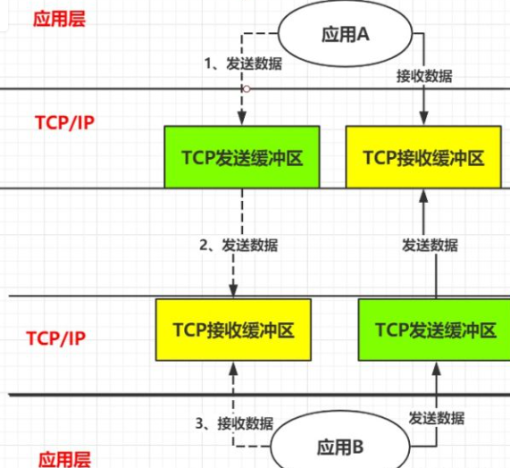
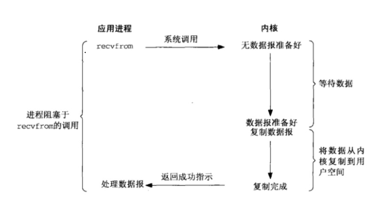
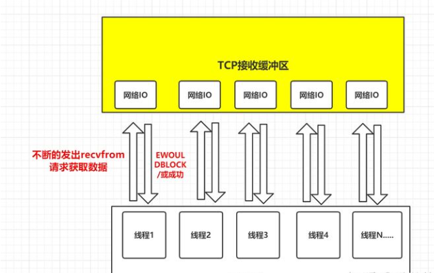
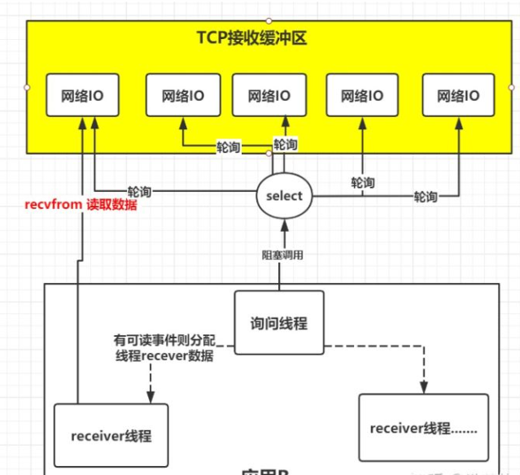
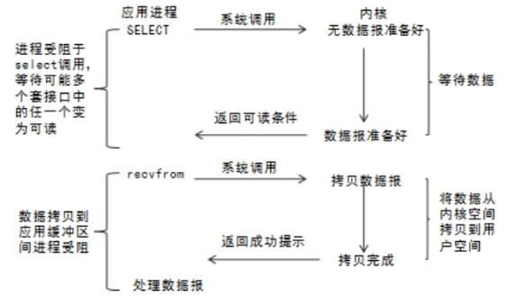
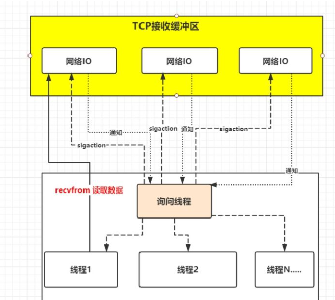
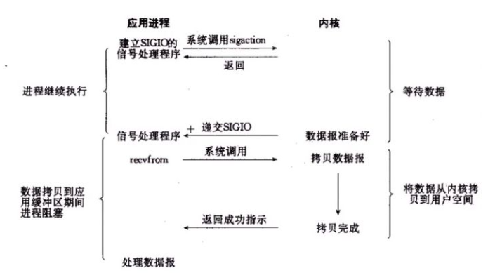
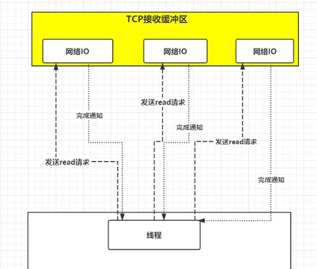
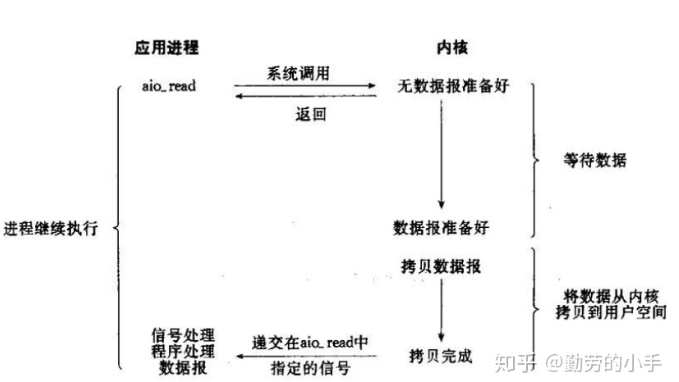

# IO模型

## 前置信息

#### 消息发送流程

一.以A向B发送消息为例，会经过如下流程：

​	1.A应用将消息发送到A服务器TCP发送缓冲区

​	2.A服务器的TCP发送缓冲区将消息发送，发送到B应用所在服务器的TCP接收缓冲区

​	3.B应用从B服务器所在TCP接受缓冲区读取自己数据

二.其中缓冲区称为内核

三.客户端与服务器端建立连接创建socket套接字之后，从socket中读取数据，如果socker数据不可读写则会阻塞

#### 阻塞问题

​	1.B应用向缓冲区发起读取申请，在缓存区不存在B所需要的数据时，B是继续等待直到数据存在，或者放弃

​	2.A应用先缓冲区写入数据，缓存区空间不足时，是局限于等待知道写入或者放弃

​	3.是否阻塞的判断的标准是io操作是否阻塞了当前的进程或线程

#### 读取数据造成的阻塞

在同步IO中，读写IO分为发起请求到读取数据，读取数据的时候其实是一个内核空间复制用户空间的过程，应用发出读取请求后，读取数据的过程中CPU执行权移交将会移交给内核去执行，因此在同步IO中程序一定会在读取数据时被挂起

## 阻塞IO

#### 描述

B在发起读取数据申请时，内核数据未准备好之前，B会一直处于等待数据状态，直到内核数据交付于B结束

#### 术语描述

在应用调用recvfrom读取数据时，其系统调用直到数据包到达且被复制到应用缓冲区中或者发送错误时才返回，在此期间一直会等待，进程从调用到返回这段时间内都是被阻塞的称为阻塞IO

#### 流程

1、应用进程向内核发起recfrom读取数据。

2、准备数据报（应用进程阻塞）。

3、将数据从内核负责到应用空间。

4、复制完成后，返回成功提示。

## 非阻塞IO

#### 描述

当应用B发起读取数据申请时，如果内核数据没有准备好会即刻告诉应用B，不会让B在这里等待,但是需要应用拷贝数据从内核到用户态，所以必然阻塞

#### 术语描述

非阻塞IO是在应用调用recvfrom读取数据时，如果该缓冲区没有数据的话，就会直接返回一个EWOULDBLOCK错误，不会让应用一直等待中。在没有数据的时候会即刻返回错误标识，那也意味着如果应用要读取数据就需要不断的调用recvfrom请求，直到读取到它数据要的数据为止

#### 流程

1、应用进程向内核发起recvfrom读取数据。

2、没有数据报准备好，即刻返回EWOULDBLOCK错误码。

3、应用进程向内核发起recvfrom读取数据。

4、已有数据包准备好就进行一下 步骤，否则还是返回错误码。

5、将数据从内核拷贝到用户空间。

6、完成后，返回成功提示。

## IO复用模型

#### 问题描述

在B从TCP缓冲区读取数据时，可能存在N个人向B发送消息，在并发的情况下，应用创建多个线程读取数据，每个线程都会调用recvfrom读取数据，并发时可能会瞬间收到上百万请求，创建上百线程，同时不断向内核发送recvfrom请求读取数据

#### 解决思路

由一个线程监控多个网络请求(称为fd文件描述符,linux系统把所有的网络请求以一个fd来标识)，这样只需要少量线程就可以完成数据状态询问的操作，当有数据准备完成之后再分配对应的线程去读取数据

#### 信息补充

1.客户端与服务端建立的`socket`连接可以称为fd

2.select()调用成功后会返回成功就绪的fd个数

3.应用程序调用select()函数将fd传给内核空间,在内核空间中不断遍历，当有fd变得就绪后，应用程序的select()调用会返回就绪fd个数，此时应用程序再通过循环遍历方式读取就绪fd数据

#### 解决思路描述

IO复用模型的思路就是系统提供了一种函数可以同时监控多个fd的操作，这个函数就是我们常说到的select、poll、epoll函数，有了这个函数后，应用线程通过调用select函数就可以同时监控多个fd，select函数监控的fd中只要有任何一个数据状态准备就绪了，select函数就会返回可读状态，这时询问线程再去通知处理数据的线程，对应线程此时再发起recvfrom请求去读取数据。

#### 术语描述

进程通过将一个或多个fd传递给select，阻塞在select操作上，select帮我们侦测多个fd是否准备就绪，当有fd准备就绪时，select返回数据可读状态，应用程序再调用recvfrom读取数据

#### 总结

复用IO的基本思路就是通过slect或poll、epoll 来监控多fd ，来达到不必为每个fd创建一个对应的监控线程，从而减少线程资源创建的目的，**主要优点在于可以同时触发多个IO任务并在每个IO完成后依次处理，但是在处理读取数据时依然会阻塞**

## **信号驱动IO模型**

#### 问题描述

复用IO模型解决了一个线程可以监控多个fd的问题，但是select是采用轮询的方式来监控多个fd的，通过不断的轮询fd的可读状态来知道是否就可读的数据，而无脑的轮询就显得有点暴力，因为大部分情况下的轮询都是无效的，更好的方式为，能不能不要我总是去问你是否数据准备就绪，能不能我发出请求后等你数据准备好了就通知我，所以就衍生了信号驱动IO模型

#### 解决思路

信号驱动IO不是用循环请求询问的方式去监控数据就绪状态，而是在调用sigaction时候建立一个SIGIO的信号联系，当内核数据准备好之后再通过SIGIO信号通知线程数据准备好后的可读状态，当线程收到可读状态的信号后，此时再向内核发起recvfrom读取数据的请求，因为信号驱动IO的模型下应用线程在发出信号监控后即可返回，不会阻塞，所以这样的方式下，一个应用线程也可以同时监控多个fd

#### 术语描述

首先开启套接口信号驱动IO功能，并通过系统调用sigaction执行一个信号处理函数，此时请求即刻返回，当数据准备就绪时，就生成对应进程的SIGIO信号，通过信号回调通知应用线程调用recvfrom来读取数据

#### 总结

IO复用模型里面的select虽然可以监控多个fd了，但select其实现的本质上还是通过不断的轮询fd来监控数据状态， 因为大部分轮询请求其实都是无效的，所以信号驱动IO意在通过这种建立信号关联的方式，实现了发出请求后只需要等待数据就绪的通知即可，这样就可以避免大量无效的数据状态轮询操作

## 异步IO

#### 问题描述

在读取数据时，需要两阶段的请求，询问数据是否准备好的select请求与读取数据的recevform请求

#### 解决思路

应用只需要向内核发送一个read 请求,告诉内核它要读取数据后即刻返回；内核收到请求后会建立一个信号联系，当数据准备就绪，内核会主动把数据从内核复制到用户空间，等所有操作都完成之后，内核会发起一个通知告诉应用，这种模式称为异步IO模型

#### 术语描述

应用告知内核启动某个操作，并让内核在整个操作完成之后，通知应用，这种模型与信号驱动模型的主要区别在于，信号驱动IO只是由内核通知我们合适可以开始下一个IO操作，而异步IO模型是由内核通知我们操作什么时候完成

#### 总结

异步IO的优化思路是解决了应用程序需要先后发送询问请求、发送接收数据请求两个阶段的模式，在异步IO的模式下，只需要向内核发送一次请求就可以完成状态询问和数拷贝的所有操作，应用只需要发出请求，数据准备与拷贝不负责，所以不存在阻塞，真正的异步

## 同步IO的特点

1.同步IO指的是用户进程触发I/O操作并等待或者轮询的去查看I/O操作是否就绪。
2.同步IO的执行者是IO操作的发起者。
3.同步IO需要发起者进行内核态到用户态的数据拷贝过程，所以这里必须由个阻塞

## 异步IO的特点

1.异步IO是指用户进程触发I/O操作以后就立即返回，继续开始做自己的事情，而当I/O操作已经完成的时候会得到I/O完成的通知。
2.异步IO的执行者是内核线程，内核线程将数据从内核态拷贝到用户态，所以这里没有阻塞

## 结束语

1.阻塞就是发起读取数据请求的时，当数据还没准备就绪的时候，这时请求是即刻返回，还是在这里等待数据的就绪，如果需要等待的话就是阻塞，反之如果即刻返回就是非阻塞

2.在IO模型里面如果请求方从发起请求到数据最后完成的这一段过程中都需要自己参与，那么这种我们称为同步请求；反之，如果应用发送完指令后就不再参与过程了，只需要等待最终完成结果的通知，那么这就属于异步

3.同步阻塞、同步非阻塞，他们不同的只是发起读取请求的时候一个请求阻塞，一个请求不阻塞，但是相同的是，他们都需要应用自己监控整个数据完成的过程。而为什么只有异步非阻塞 而没有异步阻塞呢，因为异步模型下请求指定发送完后就即刻返回了，没有任何后续流程了，所以它注定不会阻塞，所以也就只会有异步非阻塞模型了
