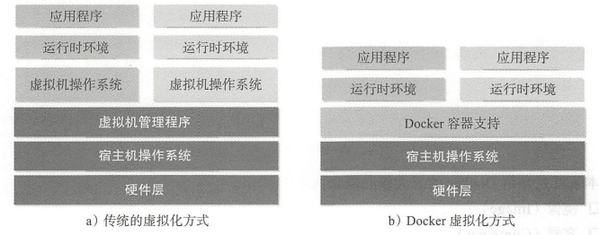
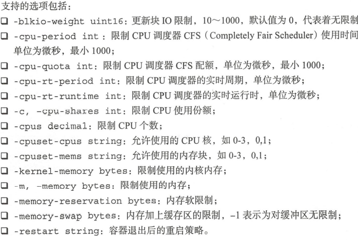
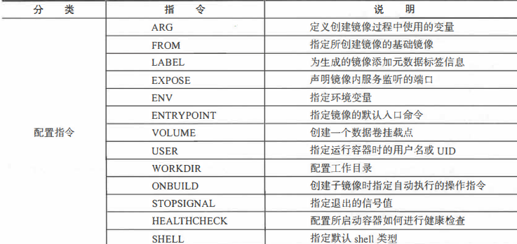
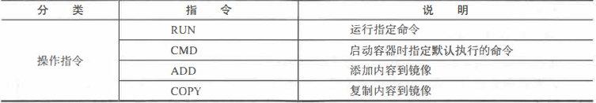

# Docker技术与入门

## 1.前置基础信息

### 1.1 虚拟化技术

在计算机技术中，虚拟化是一种资源管理技术，核心是对资源的抽象，打破原本不可分割的资源使资源重组提高利用率



### 1.2 核心概念

Docker 大部分的操作都围绕着它的三大核心概念 镜像、容器和仓库

#### 1.2.1 docker镜像

1.Docker 镜像类似于虚拟机镜像，是创建 Docker 容器的基础

2.可以将它理解为一个只读的模板，包含一个基本的操作系统环境，与其他基本的应用程序

#### 1.2.2 docker容器

1.Docker 容器类似于一个轻级的沙箱， Docker 利用容器来运行和隔离应用

2.容器是从镜像创建的应用运行实例,它可以启动、开始、停止 删除，而这些容器都是,彼此相互隔离、互不可见的

3.可以把容器看作一个简易版的 Linux 系统环境,以及运行在其中的应用程序打包而成的盒子

4.镜像自身是只读的容器从镜像启动的时候，会在镜像的最上层创建一个可写层

#### 1.2.3 docker仓库

Docker 仓库类似于代码仓库，是 Docker 集中存放镜像文件的场所

## 2.使用Docker镜像

#### 2.1 获取镜像： 

1.命令：docker [image] pull NAME [ :TAG] ，不指定版本，默认为latest

2.使用docker pull命令下载中会获取并输出镜像的各层信息。当不同的镜像包括相同的层时，本地仅存 储了层的 一份内容，减小了存储空间。

3.严格地讲，镜像的仓库名称中还应该添加仓库地址（即registry, 注册服务器）作为前 缀 ，只是默认使用的是官方服务 ，该前缀可以忽略,例如使用网易的镜像命令：docker pull hub.c.163.com/public/ubuntu:18.04

#### 2.2 查看镜像：

##### 2.2.1 使用images命令列出镜像

1.镜像大小信息只是表示了该镜像的逻辑体积大小， 实际上由于相同的镜像层本地只会存 储一份， 物理上占用的存储空间会小于各镜像逻辑体积之和

##### 2.2.2  使用tag命令添加镜像标签

```
docker tag ubuntu:latest myubuntu:latest
```

它们实际上指向了同一个镜像文件，只是别名不同而巳。docker tag命令添 加的标签实际上起到了类似链接的作用

##### 2.2.3 使用inspect命令查看详细信息

```
docker [image] inspect 获取镜像详细信息
```

#### 2.3 搜索镜像

使用 docker search 命令可以搜索 Docker Hub 官方仓库中的镜像。 语法为 docker search [option] keyword

#### 2.4 删除镜像

1.使用 docker rmi 或 docker image rm 命令可以删除镜像，加入-f参数可以强制删除

2.使用Docker一段时间后， 系统中可能会遗留一些临时的镜像文件， 以及一些没有被使 用的镜像， 可以通过docker image prune命令来进行清理

-a 删除所有无用镜像   -f 强制删除不需要进行确认

#### 2.5 创建镜像

1.基于容器创立

```
docker [container] commit [OPTIONS] CONTAINER [REPOSITORY  [:TAG]]

将已有的容器上传为镜像
```

2.基于本地模板导入

```
docker [image] import [OPTIONS] fileURL [REPOSITORY 
[:TAG] ]
比如：
cat ubuntu-18.04-x86_64-minimal.tar.gz | docker import - ubuntu:lB.04
```

3.基于dockerfile创建

```
docker image build -t
```

#### 2.6 存出于载入镜像

1 存出镜像

docker image save 将镜像打包为文件分享

2 载入镜像

 docker load -i ubuntu_18.04.tar  将镜像文件载入为镜像

## 3 操作Docker容器

容器是镜像的一个运行实例，镜像是静态的只读文件，而容器带有运行时需要的可写文件层，容器中的应用进程处于运行状态

####  3.1 创建容器

```
docker container create 创建容器，此时还未运行
docker [container] start 使容器启动
docker [container ］run 直接新建容器并启动，等价于先执行 docker [container] 
create 命令，再执行 docker [container] start 命令
```

```
当利用 docker [container] run 来创建并启动容器时， Docker 在后台运行的标准
操作包括：
1.检查本地是否存在指定的镜像，不存在就从公有仓库下载；
2.利用镜像创建一个容器，并启动该容器；
3.分配个文件系统给容器，并在只读的镜像层外面挂载一层可读写层
4.从宿主主机配置的网桥接口中桥接一个虚拟接口到容器中去；
5.从网桥的地址池配置一个IP地址给容器；
6.执行用户指定的应用程序；
7.执行完毕后容器被自动终止
```

```
docker run 参数
-i  让容器的标准输入打开
-t  让Docker分配一个伪终端并绑定到容器的标准输入
-d  让容器后台运行

```

```
查看容器的输出信息
docker container logs
-details 打印详细信息
-f 持续保持输出
-since string 输出某个时间开始的日志
-tail string 输出最近的若干日子
-t 显示时间戳信息
-until string 输出某个时间之前的日志
```

#### 3.2 停止容器

1.暂停容器

```
docker [container] pause CONTAINER [CONTAINER ... ］命令来暂
停一个运行中的容器
可以使用 docker [contai er pause CONTAINER [CONTAINER ...] 命令来恢复到运行状态
```

2.终止容器

```
1.docker [container] stop [-t | --time [=10]] [CONTANER]
该命令会首先向容器发送 SIGTERM 信号，等待一段超时时间后（默认为 10 秒），再发送SIGKLL信号来终止容器：
2.执行 docker container prune 命令，会自动清除掉所有处于停止状态的容器
3.通过 docker [container er kill 直接发送 SIGKILL 信号来强行终止
容器

```

#### 3.3 进入容器

```
docker [container] exec bash
-d 在后台执行
-i 打开标准输入接受用户输入命令
-e 指定环境变量
-t 分配伪终端
-u 执行命令的用户名或id
```

#### 3.4 删除容器

```
docker container rm
-f 强行中止并删除
-l 删除容器的连接但是保留容器
-v 删除容器挂载的数据卷

```

#### 3.5 导出与导入容器

```
docker [container] export  -o实现指定导出的文件名
```

```
docker import test_for_run.tar - test/ubuntu:vl.O
```

#### 3.6 查看容器

```
docker container inspect [OPTIONS] CONTAINER 
[CONTAINER . .. ］
查看容器详情
```

```
docker [container] top [OPTIONS] CONTAINER 
[CONTAINER . ..]
类似于linux系统的top命令，打印出容器内的进程信息
```

#### 3.7 其他容器命令

```
1.复制文件
docker container cp命令支持在容器与主机之间复制文件
例 将data复制到test容器中：
docker [container] cp data test:/tmp/ 
```

```
2.查看变更
docker container diff 查看容器内系统文件变更
```

```
3.查看端口映射
docker container port CONTAINER
比如：docker container port test 
```

4.更新配置
docker container update 



## 4 Docker数据管理

容器管理数据的两种方式：

1.数据卷 Data Volumes 容器内数据直接映射到本地主机环境；

2.数据卷容器（Data Volume Containers): 使用特定容器维护数据卷

#### 4.1 数据卷

数据卷 Data Volumes 是一个可供容器使用的特殊目录，它将主机操作系统目录直接 映射进容器，类似于 Linux 中的 mount 行为。j具有以下特性：

1，数据卷可以在容器之间共事和重用，容器间传递数据将变得高效与方便 2，对数据卷内数据的修改会立马生效，无论是容器内操作还是本地操作； 3，对数据卷的更新不会影响镜像，解摘开应用和数据 

4，卷会一直存在 ，直到没有容器使用，或者删除

##### 4.1.1 创建数据卷

```
docker volume create -d local test
除了 reate 子命令外， docker volume 还支持 inspect（查看详信息）、 ls（列出已有数据卷） prune（清理无用数据卷）、 rm（删除数据卷）
```

##### 4.1.2 绑定数据卷

还可以在创建容器时将主 地的任意路径 挂载到容器内作为数据卷，这种形式创建的数据卷称为绑定数据卷

```
在用 docker [container] run命令的时候，可以使用 mount 选项来使用数据卷,支持三种类型的数据卷
1.volume:普通数据卷，映射到主机/var/lib/docke/volumes路径下；
2.bind:绑定数据卷，映射到主机指定路径下；
3.tmpfs:临时数据卷，只存在于内存中
比如：
docker run - d - P --name web - v /webapp: /opt/webapp training/webapp python app.py
```

注：

1，本地目录的路径必须是绝对路径，容器内路径可以为相对路径，如果目录不存 在， Docker 会自动创建

2，如果直接挂载一个文件到容器，使用文件编辑工具可能会报错，简单方式是直接挂载文件所在的目录到容器内

#### 4.2 数据卷容器

数据卷容器也是一个容器，但是它的目的是专门提供数据卷给其他容器挂载

```
1.创建一个数据卷容器dbdata
docker run it -v /dbdata ame dbdata ubuntu

2.使用－－volumes-from 来挂载 dbdata 容器中的数据卷
docker run -it --volumes-from dbdata -name dbl ubuntu 
docker run -it --volumes-from dbdata －name db2 ubuntu 

3.还可以从其他已经挂载了容器卷的容器来挂载数据卷
docker run -d --name db3 --volumes-from dbl training/postgres 
```

删除一个数据卷，必须在删除最后一个还挂载着它的容器时显式使用 docker rm -v 令来指定同时删除关联的容器

#### 4.3 利用数据卷容器迁移数据

##### 4.3.1 备份

```
docker run -volumes-from dbdata -v $(pwd):/backup --name worker ubuntu tar cvf /backup/backup.tar /dbdata 

注：-v 与 -volumes-from分别挂载本地宿主机目录与容器数据卷
tar cvf将/dbdata中的数据迁移到容器内的.backup下
```

##### 4.3.2 恢复

```
1.创建容器数据卷
docker run -v /dbdata --name dbdata2 ubuntu /bin/bash 
2.解压备份
docker run --volumes-from dbdata2 -v $(pwd) :/backup busybox tar xvf /backup/backup.tar
```

## 5 端口映射与容器互联

### 5.1端口映射实现容器访问

#### 5.1.1 外部访问容器应用

1.  -P  :使用 -P 标记时， Docker 会随机映射一个 49000到49900 的端口 到内部容器开放的网络端口：
2. -p (小写的）则可以指定要映射的端口，并且，在一个指定端口上只可以绑定 一个容器。 支持的格式有 IP:HostPort:ConainerPort 或者 IP:: ContainerPort 或者 HostPort : ContainerPort，主机的配置在前

#### 5.1.2 映射所有接口地址

 1.HostPort : ContainerPort,会绑定该端口下所有IP，即任意IP都可以访问

 2.可以使用多个-p ，分配多个端口

#### 5.1.3  映射到指定地址的指定端口

IP:HostPort:ContainerPort 将格式指定映射使用一个特定地址

```
docker run -d -p 127.0.0.1:5000:5000 training/webapp py thon app.py
```

#### 5.1.4 映射到指定地址的任意端口

使用IP::ContainerPo江绑定localhost的任意端口到容器的5000端口

中间本为HostPort的位置缺省

#### 5.1.5查看映射端口配置

```
查看端口的映射  docker port nostalgic_rnorse 5000 
127.0.0.1:49155 
```

### 5.2 互联

1. 最好使用  --name 自定义容器名称，名称唯一
2. --link参数可以让容器之间安全地进行交互

```
docker run -d -P --name web --link db:db training/webapp python app.py
```

3.--link参数的格式为--link name: alias, 其中name是要链接的容器的名称alias是别名

4.在容器的/etc/hosts文件存在配置连接存在信息，可以使用ping 别名测试

## 6 使用Dockerfile创建镜像

### 6.1 基本结构

一般而言， Dockerfile 主体内容分为四部分：基础镜像信息、 维护者信息、 镜像操作指令和容器启动时执行指令

### 6.2 指令说明

一般分为操作指令与配置指令



#### 6.2.1 配置指令

1.ARG：定义创建镜像过程中使用的变量

格式：ARG <name>[=<defaault value>]

注：执行 docker build 时， 可以通过 -build-arg[=] 来为变量赋值,镜像编译完成后，ENV会在镜像保留，变量会不存在


2.FROM:指定创建镜像的基础镜像

格式：FROM  <image>  [AS  <name>]

​			FROM  <image>:<tag>   [AS  <name>]

注：任何 Dockerfile 中第一条指令必须为FROM 指令。 并且， 如果在同一个Dockerfile 中创 建多个镜像时， 可以使用多个 FROM 指令（每个镜像一次）


3.LABEL:可以为生成的镜像添加元数据标签信息。 这些信息可以用来辅助过滤出特定镜像。

格式：LABEL <key>=<value>


4.EXPOSE 声明镜像里服务监听的接口

格式：EXPOSE  <port> [<port>]

注:该指令只是起到声明作用， 并不会自动完成端口映射,映射需要-P


5.ENV 指定环境变量， 在镜像生成过程中会被后续RUN指令使用， 在镜像启动的容器中也会存在

格式：ENV  <key>=<value>

注：如 docker run --env  <key>=<value>可以将镜像的变量覆盖

```
当一条 ENV 指令中同时为多个环境变量赋值并且值也是从环境变量读取时， 会为变量都赋值后再更新
比如：
ENV keyl=value2 
ENV keyl=valuel key2=${keyl) 

等于：
keyl=valuel key2=value2，先赋值第一次，然后再更新

```


6.ENTRYPOINT 指定镜像的默认入口命令， 该入口命令会在启动容器时作为根命令执行， 所有传人值作 为该命令的参数

格式：

ENTRYPOINT ["executable", "paraml ", "param2"]: exec 调用执行

ENTRYPOINT command param 1 param2: shell 中执行

注：每个 Dockerfile 中只能有一个 ENTRYPOINT, 当指定多个时， 只有最后一个起效，docker run --entrypoint可以覆盖


7.VOLUME 创建一个数据卷挂载点

格式： VOLUME ["/data]


8.WORKDIR 为后续RUN,CMD,ENTRYPONT指派工作目录

格式：WOKDIR /path/to/workdir

注：可以使用多个WORKDIR指令，后续参数如果是相对路径，则以之前的命令指定路径


#### 6.2.2 操作指令

1.RUN 运行指定命令

格式：RUN <command>

​			RUN ["executable","param1","param2"]

注：意后者指令会被解析为 JSON 数组，因此必须用双引号 前者默认将在 shell 终端中运行命 令，即／bin /bash -c 后者则使用 exec 执行，不会启动 shell 环境

/bash -c 后面接命令 比如ls    /bash 后接脚本，是个文件


2.CMD 用来指定启动容器时默认执行的命令

格式 CMD ［"executable ＂，” param1", param2 ＇］,相当于执行 executable param 1  param2

注 多个CMD只执行最后一条


3.ADD 添加内容到镜像

格式：ADD  <src> <dest>

注：该命令将复制指定的<src>路径下内容到容器中的<dest>路径下, <src>可以是 Dockerfile 所在目录的一个相对路径（文件或目录）


4.COPY  复制内容到镜像

格式：COPY  <src> <dest>

### 6.3 创建镜像

docker image build path 通过指定目录，搜索路径下的dockerfile文件创建镜像，并将指定路径下所有的文件打包为上下文发送给dokcer服务端

可以通过-t  指定标签

### 6.4 Dockerfile建议

1.精简镜像用途：尽量让每个镜像的用途都比较集中单一，避免构造大而复杂、多功能 的镜像；

2.选择合适的基础镜像：容器的核心是应用，选择合适的镜像避免臃肿

3.正确使用版本号，避免环境不一致

4.减少镜像层数，尽量合并RUN,ADD,COPY指令，多个RUN可以写成同一行

