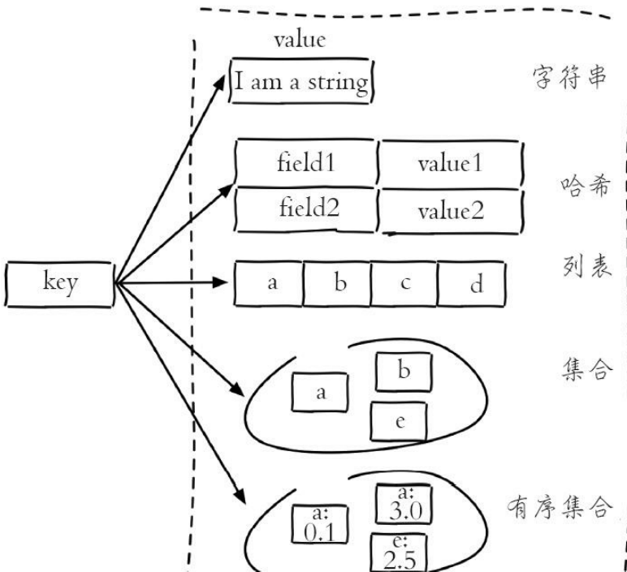
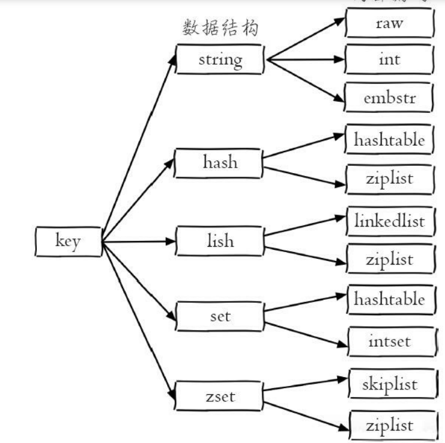

# Redis

## 1.安装与启动

```
命令：
docker run -p 6379:6379 --name redis -v /docker/redis/redis.conf:/etc/redis/redis.conf -v /docker/redis/data:/data -d redis redis-server /etc/redis/redis.conf 

```

```
命令解析：
docker run redis # 从redis镜像运行容器
-p 6379:6379 # 映射本地6379端口到容器6379端口，前为本地端口
--name redis # 设置容器名称为redis，方便以后使用docker ps进行管理
-v /docker/redis/redis.conf:/etc/redis/redis.conf # 关联本地/docker/redis/redis.conf文件到容器中/etc/redis/redis.conf，同样，前为本地
-v /docker/redis/data:/data # 关联本地/docker/redis/data到容器内/data目录，此为存放redis数据的目录，为方便以后升级redis，而数据可以留存
-d # 后台启动，使用此方式启动，则redis.conf中daemonize必须设置为no，否则会无法启动
redis-server /etc/redis/redis.conf # 在容器内启动redis-server的命令，主要是为了加载配置

```

```
配置文件：
# Redis配置文件

# Redis默认不是以守护进程的方式运行，可以通过该配置项修改，使用yes启用守护进程
daemonize no

# 指定Redis监听端口，默认端口为6379
port 6379

# 绑定的主机地址，不要绑定容器的本地127.0.0.1地址，因为这样就无法在容器外部访问
bind 0.0.0.0

#需要密码则打开
requirepass mima

# 持久化
appendonly yes

```

```
启动：

/docker/redis/redis.bash
# 查看是否已启动
docker ps
# 如果无法启动或者docker ps中无对应内容，将bash中命令复制出来，删除-d参数启动，查看报错信息
# 使用redis-cli或者rdm访问 localhost:6379
# 如需访问容器，可使用
docker exec -it redis bash
# 或直接使用redis-cli访问容器内redis
docker exec -it redis redis-cli [-a mima] [-h 端口默认 127.0.0.0] [-p 默认6379]

停止：
docker exec -it redis redis-cli shutdown
```

## 2.API的理解与使用

### 2.1 前置知识

#### 2.1.1 全局命令

1.查看所有键 keys *

2.设置字符串的键 set hello world

3.设置列表是键 rpush mylist a b c d e f

4.键总数 dbsize 注：该命令直接获取内置的键总数变量，时间复杂度是O(1),keys命令会遍历所有键，时间复杂度是O(n)

5.检查键是否存在：exists key

6.删除键：del a b c

7.键过期：expire key seconds，ttl命令会返回键的剩余过期时间

#### 2.1.2 数据结构与内部编码

1.五种数据结构



2.内部编码结构



3.优势

   (1) 可以改进内部编码，而对外的数据 结构和命令没有影响，这样一旦开发出更优秀的内部编码，无需改动外部数 据结构和命令

（2）多种内部编码实现可以在不同场景下发挥各自的优势


### 2.2 字符串

#### 2.2.1 命令


```
1.设置值
set key value [ex seconds] [px milliseconds] [nx|xx]
set命令有几个选项：
·ex seconds：为键设置秒级过期时间。
·px milliseconds：为键设置毫秒级过期时间。
·nx：键必须不存在，才可以设置成功，用于添加。
·xx：与nx相反，键必须存在，才可以设置成功，用于更新。


2.值是否存在
 exists hello
 
3.获取值
get hello

4.批量设置值
mset a 1 b 2 c 3 d 4

5.批量获取
 mget a b c f
 
 批操作可以提高开发效率，单次命令需要n次网络传输操作与执行命令，批处理单次网络，多次执行命令时间
 
 6.incr自增命令，Redis提供了decr（自减）、incrby（自增指定数字）、
decrby（自减指定数字）、incrbyfloat（自增浮点数）

7.在字符串后拼接字符串
append key world

8.字符串长度
strlen key

9.设置并返回原值
127.0.0.1:6379> getset hello world
(nil)
127.0.0.1:6379> getset hello redis
"world"

10.设置指定位置的字符，修改
setrange key offeset value

11.获取指定范围字符串
getrange key start end 左闭右闭


```

### 2.2 哈希

```
1.设置值
 hset user:1 name tom
 hset key field value
 注：user:1是key   name为key对应的哈希数据的key此处称为field  tome为value  name与key称为哈希的值,理解为key为组别，field value为组所包含性质
 
2.获取值
hget key field
hget user:1 name

3.删除filed
hdel key field [field ...]

4.计算field个数
hlen key

5.批量设置或获取
hmget key field [field ...]
hmget user:1 name city

hmset key field value [field value ...]
hmset user:1 name mike age 12 city tianji

6.field是否存在
hexists key field

8.获取所有field
hkeys key

9.获取所有values
hvals values

10.获取所有field-value
hgetall key

11.hincrby hincrbyfloat
作用域为field

12.计算value的字符串长度
hstrlen key field
```

