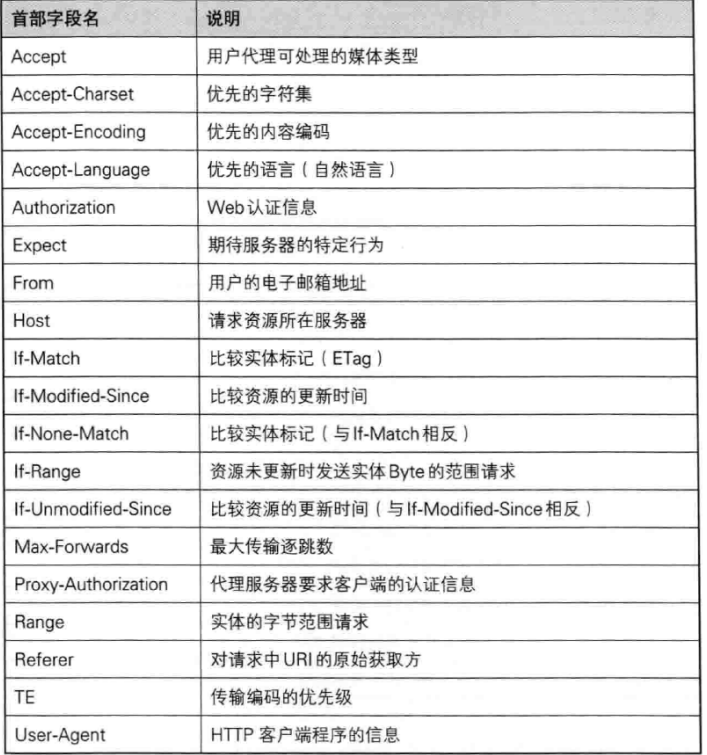

# 图解HTTP

## 1.前置消息

### 1.1 TCP/IP四层

1.应用层：决定了向用户提供应用服务时通信的活动，http协议处于该层

2.传输层：对上层应用层提供处于网络连接中的两台计算机之间的数据传输，

有TCP与UDP,确定稳定传输，不涉及路线

3.网络层：处理网络上流动的数据包，数据包是网络传输的最小单位，该层作用是确定了传输路径

4.链路层：用来处理链接网络的硬件部分，物理上的硬件都属于链路层

### 1.2 通信传输流

### 1.3 与HTTP密切相关的IP,TCP,DNS

#### 1.3.1 IP协议

1.ip协议：传输层负责确保数据送到目标节点，运输层的IP协议负责选择路线，因此需要IP地址，表明了目标节点被分配到的地址，MAC地址，表示了网卡所属固定地址，二者可进行配对

2.ARP协议是地址解析协议可以将IP地址转化为MAC地址，以MAC地址来抖索下一个中转目标

3.在完成传输前，中转机器只能获得很粗略的传输路线，机制称为路由选择

#### 1.3.2 TCP协议

1.TCP位于传输层，提供可靠的字节流服务，字节流即为了方便传输，将大块数据分割成以报文段为单位的数据包进行管理，并且可以确认数据最终是否送达到对方

2.主要使用三次握手以确定可靠的传输

##### 1.3.2.1  三次握手

一.TCP报文包含：

1，seq序号，用来标识从TCP源端向目的端发送的字节流，发起方发送数据时对此进行标记

2，Ack=seq+1 确认号，ACK标志位为1时，确认号字段才有效

3，标志位：ACK确认序号有效，SYN发起连接，FIN释放连接

二，三次握手：

1.所谓的三次握手即TCP连接的建立。这个连接必须是一方主动打开，另一方被动打开的

2，为什么进行第三次握手

1. 第三次握手是客户端向服务器端发送数据，告诉服务器客户端是否收到服务器第二次握手发送的数据，如果成功接收则建立连接，否则连接失败，关闭端口，减少服务器开销和接收到失效请求发生的错误
2. 如果不存在第三次连接，第二次握手是数据丢失，客户端在未曾收到服务端数据且时间超时后会再次请求新地连接，而服务端并不知道，原连接将会一直占用

##### 1.3.2.2  四次挥手

1.所谓的四次挥手即TCP连接的释放(解除)。连接的释放必须是一方主动释放，另一方被动释放

##### 1.3.2.3  为什么握手三次，挥手却要四次

1.TCP建立连接时之所以只需要"三次握手"，是因为在第二次"握手"过程中，服务器端发送给客户端的TCP报文是以SYN与ACK作为标志位的。SYN是请求连接标志，表示服务器端同意建立连接；ACK是确认报文，表示告诉客户端，服务器端收到了它的请求报文，即建立连接报文与ACK确认接收报文是同一次握手确认，四次挥手则是因为释放报文与确认报文分开传输

2.为什么四次挥手需要分开传输

​	1.建立连接时，服务器端不需要准备可以直接返回SYN与ACK报文，并建立连接

​	2.释放连接时，确认与释放连接不可同时发送，因为还需要处理必要的数据，需要先返回ACK确认收到报文，经过CLOSE-WAIT阶段准备好释放连接之后，才能返回FIN释放连接报文

##### 1.3.2.4 客户端在关闭前等待2ms

​	1.当客户端发出最后的ACK确认报文时，并不能确定服务器端能够收到该段报文。所以客户端在发送完ACK确认报文之后，会设置一个时长为2MSL的计时器

​	2.MSL即是服务器端发出为FIN报文和客户端发出的ACK确认报文所能保持有效的最大时长,服务器端在1MSL内没有收到客户端发出的ACK确认报文，就会再次向客户端发出FIN报文

​	3.如果客户端在2MSL内，再次收到了来自服务器端的FIN报文，说明服务器端由于各种原因没有接收到客户端发出的ACK确认报文。客户端再次向服务器端发出ACK确认报文，计时器重置，重新开始2MSL的计时

​	4.否则客户端在2MSL内没有再次收到来自服务器端的FIN报文，说明服务器端正常接收了ACK确认报文，客户端可以进入CLOSED阶段，完成“四次挥手”

#### 1.3.3 DNS协议

该协议实现域名与IP地址之间的相互映射

### 1.4 各种协议与HTTP之间的关系与流程

以发送一个web请求为例

1.客户端通过DNS的负责部分，获取IP地址

2.HTTP的职责：生成针对WEB服务器的HTTP请求报文

3.TCP的职责：将报文分成报文段可靠的将报文段传输出去

4.IP的职责：选择路径，将报文段中转与传送出去

5.TCP的职责：将报文段按顺序进行组合

6.HTTP的职责：对web服务器的请求的内容进行处理

### 1.5 URL与URI与URN

1.URL：统一资源定位符，标识资源在网络上的唯一路径

2.URN：是网络资源的唯一标识，但是并不会标识路径，即如何寻找到资源

3.URI: URL与URN的超集，在标识路径的同时还具有身份标识，是由某个协议方案表示的资源的定位标识符

## 2.简单的HTTP协议介绍

### 2.1 请求与响应

1.请求报文的结构

2.响应报文的结构

### 2.2 基本请求方法

1.get:用于请求获取已被定位的文件资源

2.post:用于传输实体主体，其主要目的并不是获取响应的主题内容

3.put:用来传输文件，要求在请求报文的主体包含文件内容，然后保存到URI指定的位置，不带验证机制，存在安全问题

4.head:获取报文首部，与get相似，不过不需要主体,用于获取基本信息

5.delete:与put相反，删除指定URI位置的资源，但是也不存在验证，具有安全隐患

6.options:询问支持的方法

7.TRACE:追踪路径

### 2.3 持久连接节省通信量

1.持久连接：在原始中，请求一次需要建立一次连接，后更改为在某一段未曾明确白送断开前，都保持连接

2.管线化：修改早期必须得到相应后才请求下一个的设定，可以不等待响应，同时多个请求

### 2.4 使用cookie状态管理

1.HTTP是无状态协议，不对之前发送过的请求和响应的状态进行管理，即无法根据之前的状态进行本次的请求处理，跳转web页面就需要多次登录，或者在请求报文中增加参数

2.cookie技术，客户端会根据响应报文中的set-cookie的首部信息字段，保存cookie，下次请求时报文加入cookie值，服务端将会按照自己的规则进行cookie验证

## 3.HTTP报文内的HTTP信息

http协议的交互的信息称为http报文，分为请求报文与响应报文，本身是多行（CR+LF作换行符）数据构成的字符串文本

### 3.1 请求报文与响应报文的结构

请求行：包含请求的方法，URI和HTTP版本

状态行：响应结果的状态码，原因短语,http版本

首部字段：表示请求和响应的各种条件和属性的各类首部，一般有四种

### 3.2 编码提升传输速率

在传输时编码后可提升速率，有效处理大量的访问请求，但是会消耗更多CPU等资源用来编码

#### 3.2.1 报文主题与实体主体的差异

1. 报文是HTTP通信中的基本单位，由八位字节流组成
2. 实体作为请求或者响应的有效荷载数据被传输，由实体首部与实体主题组成，实体首部会放在报文首部中
3. 报文的主体用于传输请求或响应的实体主体，通常报文主题等于实体主题，只有当传输中进行编码操作时，实体的主题的内容发生变化，才导致出现差异

## 4.返回结果的HTTP状态码

### 4.1 状态码

第一位表示分类，后两位无分类

常用的状态码：

#### 4.1.1 2XX 处理成功

1.200 ok, 表示客户端的请求被服务器端正常处理

2.204 not content,表示服务端接受的请求已经成功处理，但是无数据返回，一般用于客服端向服务器发送数据，而对客户端不需要发送新信息

3.206 partial content，表示客户端进行了范围请求，由响应报文中给content-range指定范围的实体内容

#### 4.1.2 3XX重定向

1. 301 moved permanently ，永久重定向表示请求的资源被分配了新的URL，当资源的路径忘记添加斜杠时，就会产生301状态码

2. 302 found,临时重定向，与301类试，但302只是临时，存在改变的可能
3. 303 see other,表示需要访问其他的URL与302相似，但是303明确表示客户端应该使用get方法
4. 304 not modified,与重定向没有关系，服务端允许请求访问资源，但是未满足请求条件，不返回任何响应的主体部分

#### 4.1.3 4XX客户端错误

1. 400 bad request,表示请求报文存在语法错误，需要修改请求内容再次发送
2. 401 unauthorized,表示发送的请求需要通过http认证，返回401响应时必须包含www-authenticate用于质询用户信息，首次收到401返回时，弹出认证的对话框
3. 403 forbidden,表示请求资源的访问服务被服务器拒绝
4. 404 not found，表示服务器上无法找到请求的资源，也可用于服务器拒绝请求且不想说明理由时使用
5. 405 method nit allowed请求方法错误，比如get 与 post

#### 4.1.4 5XX服务器错误

1. 500 internal server error ，表示服务器端在执行请求时发生错误
2. 503 service unavailable,表示服务器暂时处于超负载或正在停机维护

## 5.web服务器

### 5.1 通信数据转发程序，代理，网关，隧道

#### 5.1.1 代理 

具有转发功能的应用程序，在服务器端和客户端中间人角色，客服端看他为服务器，服务器看他为客户端

1.缓存代理，代理转发响应时，缓存代理会预先将资源的副本保存在代理服务器上，当代理获取对相同资源的请求时，就可以不访问源服务器，而是使用之前的缓存资源

2.透明代理，转发请求或响应时，不对报文做任何加工的代理类型称为透明代理，反之为非透明代理

#### 5.1.2 网关

1.是转发其他服务器通信数据的服务器，与代理十分相似，但是可以使通信线路上的服务器提供非http协议服务

2.可以提高通信的安全性，因为可以在客户端与网关之间的通信线路上加密以确保连接的安全性

#### 5.1.3 隧道

隧道是在相隔甚远的客户端与服务器两者之间进行中转，并保持双方通信连接的应用程序

1.隧道按要求建立一条与其他服务器的通信线路，使用SSL等加密手段进行通信，目的是确保客户端与服务器进行安全的通信

2.隧道不会解析HTTP请求，会保持原样中转，隧道会在双方断开连接时结束

### 5.2 保存资源的缓存

缓存服务器是代理服务器的一种，归类在缓存代理类型中，利用缓存可以避免多次从源服务器转发资源，客户端可就近从缓存服务器获取资源，而源服务器不必多次处理相同请求

1. 缓存的有效期限，在判断失效后，缓存服务器会再次请求源服务器
2. 缓存不但可以存在缓存代理服务器中，也可以存在于客户端中

## 6.HTTP首部

### 6.1 HTTP首部字段

首部字段是为了给浏览器和服务器提供报文主体大小，使用的语言，认证信息等

#### 6.1.2 首部字段结构

结构为，首部字段名：字段值

#### 6.1.3 4种HTTP首部字段类型

1.通用首部字段，请求与响应报文都会使用的首部

2.请求首部字段，补充了请求的附加内容，客户端信息，相应内容优先级等

3.响应首部字段，补充了响应的附加内容，也会要求客户端附加额外的内容信息

4.实体首部字段，补充了资源的内容更新时间与实体有关的信息

### 6.2 通用首部字段

#### 6.2.1 cache-control

操作缓存的工作机制，指令的参数是可选的，多个指令用,分隔，可用于请求与响应

1.cache-control:public ，表明其他用户也可利用缓存

2.private,与public相反，缓存服务器会对特定用户提供资源缓存服务，其他的用户代理服务器不会缓存

3.no-cache:表示客服端不接受缓存的数据，源服务器也不允许数据被缓存，防止获取过期的数据，并不是不缓存而是防止缓存过期数据，所以强行要求访问源服务器，也可配合与pragma使用，都表示不接收缓存

4.no-store 相比于no-cache，强制不允许缓存

5.s-maxage,max-age相同，只适用供多位用户使用的公共缓存服务器，对于向统一用户重复返回响应的服务器来说无作用

6.max-age,与缓存服务器的缓存数据的以存在时间做比较，缓存时间小于max-age时，可以直接使用缓存数据，为0时，则不适用缓存，直接访问原数据

7.max-stale,设定过期时间在该范围内的数据仍可使用

8.only-if-cached,仅在缓存服务器本地缓存目标资源的情况下才会要求返回

9.must-revalidate,代理会向源服务器再次验证即将返回的响应缓存是否有效

10 no-transform 无论在请求还是响应，缓存都不能改变实体主体的媒体类型

#### 6.2.2 connection

1，控制不再转发的首部字段

2，默认的http连接为持久连接，当为closse时，关闭连接

#### 6.2.3 Date

表明创建的时间与日期

#### 6.2.4 trailer

表明在报文主体被分割运输后，其后还存在首部字段

#### 6.2.5 transfer-encoding

规定分块传输报文主体时采用的编码方式

#### 6.2.6 via

常与trace方法使用，表示代理通过的路径

#### 6.2.7warning

表示与缓存相关的警告消息

### 6.3 请求首部字段

​	1.accept 用户代理能够处理的媒体类型及相对优先级

2. accept-charset 指定使用的字符集
3. accept-encoding 内容编码及优先级
4. accept-language 客户端可以展示使用的语言集
5. authorization  用于传递认证消息，通常在收到401状态码后，会把该字段加入
6. from 用户代理的用户的电子邮件地址
7. host 在同一个服务器又用多个web服务时说明服务的端口
8. if-match 与资源的etag值对比，两者相同时，才会执行请求
9. if-modified-since 当资源在指定时间后更新过则接受请求
10. if-none-match 与资源的etag值对比，两者不相同时，才会执行请求
11. if-range,后接range字段，与资源的etag值相等时，当范围请求处理，反之返回全部资源
12. if-unmodified-since 在指定日期后未更新的情况下才请求
13. max-forwards 指定报文可以转发的次数
14. proxy-authorization 与authorization类似，不过前者是客户端与代理服务器，后者是客户端与服务器
15. range 返回指定范围字节的数据
16. referer 告诉服务器请求的原始资源的URL
17. user-agent 将创建请求的浏览器与用户代理名称等信息传达给服务器

### 6.4 响应首部字段

1.accept-range,表示服务器是否可以处理范围请求，bytes表示可以,none表示不可以

2.age 表示在多久前创建了响应

3.etag 告诉客户端实体的标识，将资源以字符串形式做唯一性标识的方式，服务器为每份资源分配对应的etag，资源更新时，etag也会更新，发生细微也会更改的tag为强tag，只有根本发生改变才会修改的为弱tag

4.location 与3XX配合使用，返回重定向后的URL

5.proxy-authenticate 返回代理服务器所要求的验证信息 

6.retry-after 告知客户端应该在多久后再次发送请求

7.告诉客户端当前服务器上安装的HTTP服务器应用程序的信息，比如APACH

8.www-authenticate 传输服务器与客户端之间认证

### 6.5 实体首部字段

1.Allow 用于指定服务器接受指定资源的方法，与此同时还会将支持的方法写入allow

2.content-encoding 表示服务器对实体的主体部分的不丢失实体信息的前提下所进行压缩的内容编码方式

3.content-language 告知实体主体所用的语言

4.content-length 实体主体的大小

5.content-location 在返回页面内容与实际请求的对象不同时，会写明实际url

6.content-range 表示当前发送部分及整个实体的大小

7.content-type 主体内容对象的媒体类型

8.last-modified 指定资源的最终修改时间

### 6.6 cookie首部字段

1.set-cookie 

## 7.HTTPS

### 7.1HTTP缺点

#### 7.1.1 通信使用明文可能被窃听

可以与ssl(安全套接层)组合的https协议，先使用ssl建立安全通信线路

#### 7.1.2 HTTP不验证双方身份

1.无法确认目标web服务器是否是伪装服务器

2.无法确认客户端是否被更改为伪造客户端

3.无法确定双方是否具有访问权限

4.无法判定请求来自何方，出自谁收

5.即便是无意义也会接受，无法阻止DDOS

#### 7.1.3 查明对手证书

ssl使用由值得信任的第三方机构发布的证书，以证明服务端与客户端是真实存在的

#### 7.1.4 无法证明报文完整性

1.无法确认保证完整性，请求或响应遭到篡改也不知道，在传输途中被攻击者拦截并篡改内容的攻击称为中间人攻击

### 7.2 HTTP+加密+认证+完整性=HTTPS

https是在http与tcp连接前加入ssl

#### 7.2.1 公开密钥加密

加密算法公开，密钥私有，加密解密都需要密钥

1.加密解密同一把密钥称为对称密钥加密，也叫共享密钥加密，但是发送密钥无法确保密钥没有被破解的风险

2.使用两把密钥的公开密钥加密，使用非对称密钥，公开密钥随意发布，私有密钥不可暴露，发送一方使用接收方的公钥加密，接收方使用自己的私钥解密，避免了私钥传输

3.公开密钥加密复杂度高于共享，效率低，可以通过公开密钥加密传递私钥，在通过安全传输的私钥进行共享密钥加密

4.为了确保公开密钥安全的传输，获取的不是被篡改后的密钥，可以将密钥传递给信任的第三方机构，在获取密钥后向机构证实是否为目标服务器，与网站相似，具有证书

5.ssl与tsl需要解密加密所以需要更多的时间与资源

## 8 HTTP协议的追加

### 8.1 HTTP的瓶颈

1.一条连接只能一个请求

2.请求只能从客户端开始，不接受响应之外的指令

3.首部信息不会压缩，首部信息越多延迟越大

4.每次发送相同 的首部冗余太多，浪费多

5.非强制压缩发送，有时不压缩也发送

## 9  WEB的攻击技术

### 9.1 针对web的两种攻击模式

主动攻击：直接访问web应用，把攻击代码传入的攻击模式，代表性由SQL注入攻击，OS攻击注入

被动攻击：引诱用户触发设置好的陷阱，常常是邮件，窃取用户的身份，对web发起攻击，代表由跨站请求攻击与跨站请求伪造

### 9.2 因输出值转义不完全引发的安全漏洞

1.跨站脚本攻击（XSS），通过存在安全漏洞的web网站注册用户的浏览器内允许非法的html或javascript进行攻击，创建的html部分可能存在隐藏的安全漏洞，可以利用虚假输入表单获取用户个人信息，获取cookie值，发送恶意请求，显示伪造的文章与图片

2.sql注入攻击，设定特殊的字符参数 传入sql语句，比如加入--，使部分参数无效

3.os命令注入攻击，通过web应用，执行非法的操作系统命令达到攻击的目的，在能调用shell函数的地方都存在风险

4.http首部注入攻击：在响应首部字段插入换行，添加任意响应首部或主体的一种攻击，向首部主体添加内容的攻击称为HTTP响应阶段攻击，造成设置任意cookie信息，重定向到任意url,显示任意主体

5.目录遍历攻击：在由外部指定文件名的处理存在疏忽的情况下，用户可使用../等相对路径定位到绝对路径